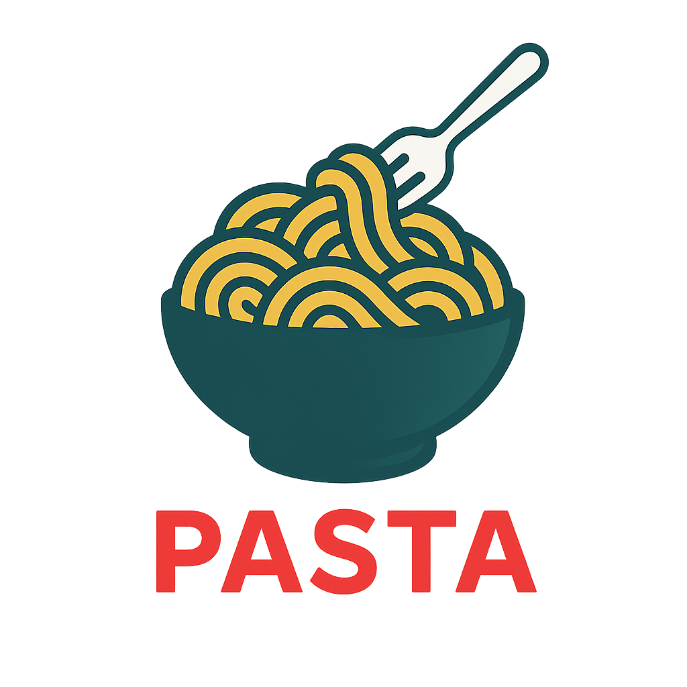

[](https://github.com/utensils/pasta/actions/workflows/test.yml)
[](https://github.com/utensils/pasta)
[](https://opensource.org/licenses/MIT)
[](https://www.python.org/downloads/)
[](https://github.com/utensils/pasta)

# Pasta



A cross-platform system tray application that converts clipboard content into simulated keyboard input, bridging the gap for applications that don't support direct clipboard pasting.

## Features

- 📋 **Clipboard History**: Automatically saves everything you copy
- 🔍 **Searchable History**: Find past clipboard items quickly
- 🔒 **Security First**: Encrypts sensitive data, excludes password managers
- 🎯 **Smart Paste Modes**: Multiple methods for different applications
- ⚡ **Adaptive Performance**: Adjusts typing speed based on system load
- 🛑 **Emergency Stop**: Double ESC instantly aborts any operation
- ✂️ **Snippet Management**: Save and organize frequently used text
- 🎨 **Modern UI**: PySide6-based settings and history windows
- 🌍 **Cross-Platform**: Windows, macOS, and Linux support

## Quick Start

```bash
# Install UV package manager
curl -LsSf https://astral.sh/uv/install.sh | sh

# Clone and setup
git clone https://github.com/utensils/pasta.git
cd pasta
uv sync --all-extras

# Run Pasta
uv run python -m pasta
```

## Platform Requirements

### macOS
- Grant accessibility permissions when prompted
- System Preferences → Security & Privacy → Accessibility

### Windows
- May require administrator privileges for some applications

### Linux
- Add user to input group: `sudo usermod -a -G input $USER`
- Log out and back in

## Usage

1. **Launch**: Pasta runs in your system tray
2. **Copy**: Use Ctrl+C (Cmd+C on macOS) - content is saved to history
3. **View History**: Right-click tray icon → History to see clipboard items
4. **Paste from History**: Select an item in history and click "Copy to Clipboard"
5. **Emergency Stop**: Double ESC to abort any paste operation

### Paste Modes

Pasta offers three paste modes that control how text is pasted when using "Paste Last Item":

- **Auto Mode** (default): Automatically selects the best method based on text length
- **Clipboard Mode** (blue icon): Uses standard system clipboard paste
- **Typing Mode** (orange icon): Simulates keyboard typing character-by-character
  - Useful for applications that don't accept clipboard paste
  - Works around security restrictions in some applications
  - Visual feedback with orange tray icon

To use typing mode:
1. Right-click tray icon → Paste Mode → Typing
2. Copy text normally (Cmd+C/Ctrl+C)
3. Right-click tray icon → "Paste Last Item (typing)"

### System Tray Menu

- **Paste Mode**: Switch between Auto / Clipboard / Typing modes
- **Paste Last Item**: Paste the most recent clipboard item using current mode
- **History**: View and search all clipboard history
- **Settings**: Configure all options
- **Emergency Stop**: Abort current operation (when pasting)

## Development

### Using UV (Recommended)

```bash
# Setup development environment
uv sync --all-extras --dev
uv run pre-commit install

# Run tests (92% coverage)
uv run pytest
uv run pytest --cov=pasta

# Code quality
uv run ruff check . --fix
uv run ruff format .
uv run mypy src/
```

### Using Nix (NixOS/Nix Package Manager)

For NixOS users or those with Nix package manager installed, a development flake is provided:

```bash
# Enter development shell with all dependencies
nix develop

# Or with direnv (after 'direnv allow')
cd pasta  # Environment loads automatically

# Use the interactive menu
menu  # Shows all available commands

# Quick commands in Nix shell
setup        # Initial project setup
run-pasta    # Run the application
test         # Run all tests
lint         # Check code quality
dev          # Run with auto-reload
```

The Nix development environment includes:
- Python 3.11 with all dependencies
- Qt6 and GUI libraries
- Platform-specific tools (xdotool, xclip, etc.)
- Development tools (ruff, mypy, pytest)
- Pre-configured environment variables
- Interactive command menu

Available Nix shells:
- `nix develop` - Full development environment with menu
- `nix develop .#minimal` - Minimal shell without menu
- `nix develop .#ci` - CI/CD environment (headless)

## Architecture

- **Core**: Clipboard monitoring, keyboard simulation, storage
- **GUI**: PySide6-based tray, settings, and history windows
- **Security**: Fernet encryption, sensitive data detection
- **Platform**: OS-specific permission and feature handling

## Security Features

- Encrypted storage for sensitive clipboard data
- Pattern-based detection of passwords and API keys
- No network connections or telemetry
- Configurable privacy mode
- Application exclusion lists

## Building

```bash
# Package for distribution
uv build

# macOS app bundle
./scripts/build_macos.sh

# Windows/Linux executable
uv run pyinstaller pasta.spec --clean
```

## Contributing

1. Fork the repository
2. Create a feature branch
3. Write tests first (TDD approach)
4. Implement your feature
5. Ensure tests pass and coverage remains >90%
6. Submit a pull request

## License

MIT License - see [LICENSE](LICENSE) file for details.
