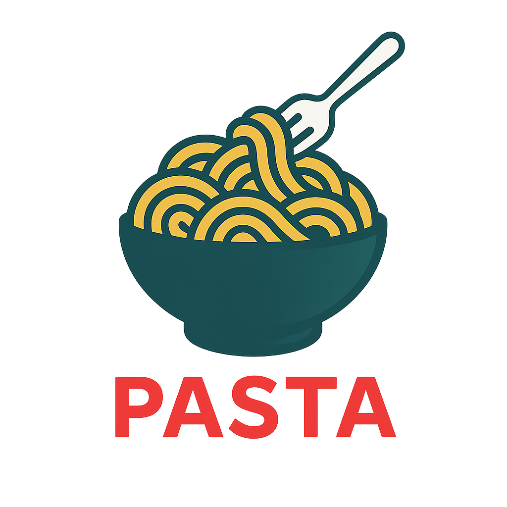

# Pasta

[](https://github.com/utensils/pasta/actions/workflows/rust.yml)
[](https://github.com/utensils/pasta/actions/workflows/build.yml)
[](https://codecov.io/gh/utensils/pasta)
[](https://github.com/utensils/pasta/actions/workflows/license-check.yml)

<p align="center">
  
</p>

A minimal system tray application that types your clipboard content. Perfect for situations where standard paste doesn't work.

## Installation

### Download Pre-built Binaries

Download the latest release from the [Releases page](https://github.com/utensils/pasta/releases).

### Run with Nix

If you have Nix installed, you can run Pasta directly without installing:

```bash
nix run github:utensils/pasta
```

#### macOS Users - Important Note

The macOS builds are currently unsigned. To run Pasta on macOS, you'll need to remove the quarantine attribute:

**Using Terminal (Recommended):**
```bash
# After installing Pasta.app to Applications folder
xattr -d com.apple.quarantine /Applications/Pasta.app
```

This command removes the quarantine flag that macOS adds to downloaded applications. You only need to run this once.

**Alternative Methods:**
- **Right-click Method**: Right-click on Pasta.app and select "Open" (may not work on all systems)
- **System Settings**: Check System Settings > Privacy & Security for "Open Anyway" option

### Build from Source

```bash
# Prerequisites
# - Rust 1.70+
# - Platform-specific dependencies (see Tauri docs)

# Clone and build
git clone https://github.com/utensils/pasta.git
cd pasta
cargo install tauri-cli --version '^2.0.0' --locked
cargo tauri build
```

## Usage

1. Launch Pasta - appears in system tray
2. Copy text normally (Ctrl+C/Cmd+C)
3. Click "Paste" in tray menu to type it out

Adjust typing speed and left-click behavior from the tray menu.

## Configuration

Pasta stores its configuration file in the following locations:

- **macOS**: `~/Library/Application Support/com.pasta.app/config.toml`
- **Linux**: `~/.config/pasta/config.toml`
- **Windows**: `%APPDATA%\pasta\config.toml`

The configuration file is automatically created on first run with defaults (normal typing speed, left-click shows menu) and saves your preferences.

## Development

```bash
# Run in development mode
cargo tauri dev

# Run tests
cargo test --lib

# Using Nix (recommended)
nix develop
menu  # Shows all available commands
```

## License

MIT License - see [LICENSE](LICENSE) file for details.